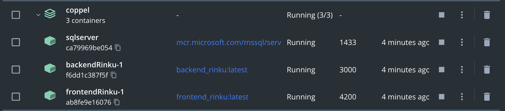
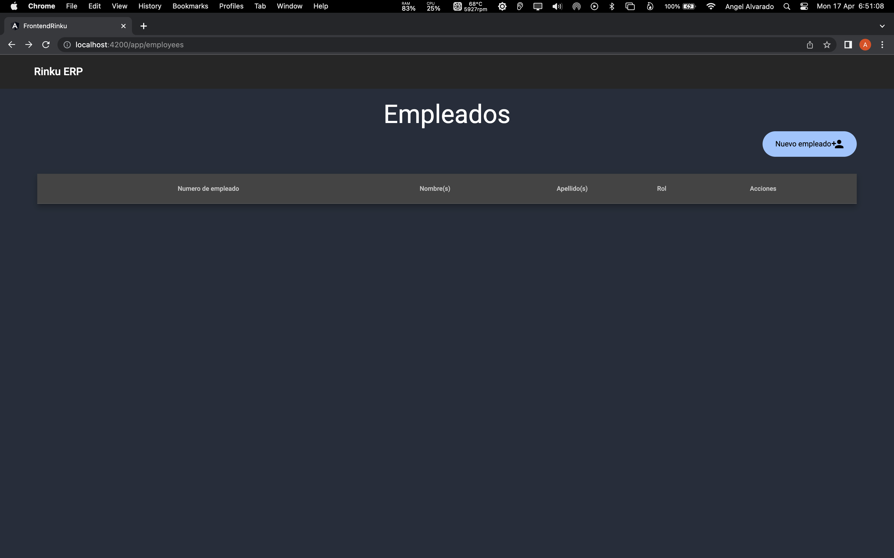

# Coppel - Prueba técnica Software Architect Senior

# Objetivo:

Aplicación de cálculo de nomas según los requerimientos de las pruebas.

# Requerimientos:

- Docker Desktop

    Guia de instalación: [https://docs.docker.com/desktop/](https://docs.docker.com/desktop/)


# Procedimiento:

1. Instalar Docker y correr su programa

    Guía para instalar Docker según el Sistema Operativo: [https://docs.docker.com/desktop/](https://docs.docker.com/desktop/)

2. Ejecutar el siguiente comando:

    ```bash
    docker-compose version
    ```

3. Si la ejecución es exitosa y docker compose está instalado correctamente, se pueden correr todos las imágenes de docker utilizando este comando:

    ```bash
    git clone https://github.com/AngelAngelopoulos/rinku-coppel.git
    cd rinku-coppel
    touch .env #o puede usar nano o vim, hay que reemplazar los valores necesarios en este archivo antes de cualquier otra cosa 
    docker-compose up -d
    ```

4. Tras esperar 2 minutos, en lo que la base de datos es instanciada, correr este comando:

    ```bash
    docker exec -it sqlserver /opt/mssql-tools/bin/sqlcmd -S localhost -U SA -P reallyStrongPwd123  -i /var/opt/mssql/database.sql
    ```

5. En la consola de visualización de docker desktop deberá verse de la siguiente manera:

    


1. Al final, en [http://localhost:4200/api/v1](http://localhost:4200/api/v1) se podrá ver la aplicación corriendo.

    


user: user123

password: password123

# Documentación

La documentación se encuentra en la carpeta del frontend, pero una vez corriendo, se podrán consultar en [http://localhost:4200/frontend/docs](http://localhost:4200/frontend/docs) y [http://localhost:4200/backend/docs](http://localhost:4200/backend/docs)

# To do:

- Implementar endpoints CRUD que faltan para workday
- Implementar middlewares con roles
- Implementar validaciones en backend
- Implementar atomización de componentes para el front con Angular
